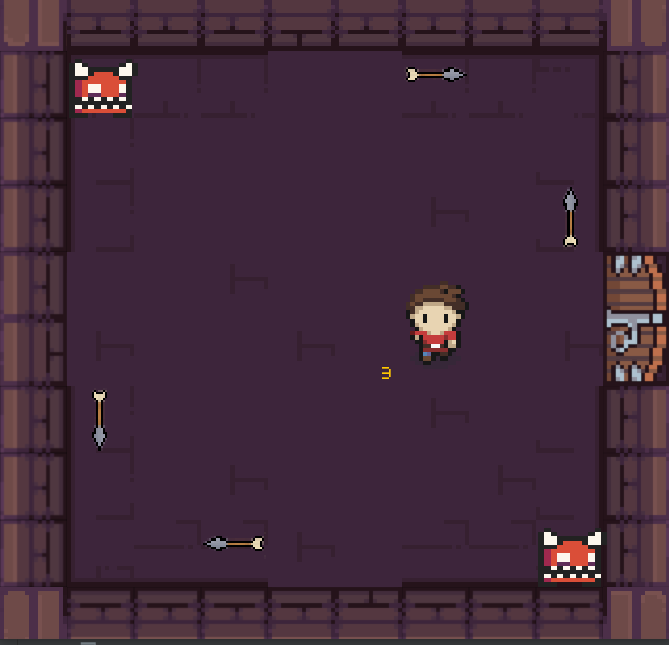

# ICRogue

ICRogue is a compact, top‑down, room‑based roguelike written in Java on top of the EPFL CS107 “Play” framework. Battle through a small dungeon where each room is its own challenge—unlock doors, collect the magic staff and the key, and conquer the boss to clear the level.

<p align="center">
   
</p>

Originally created as part of the 2022 EPFL CS107 programming project.

## Features

- Level 0 dungeon composed of connected rooms (doors unlock when a room’s challenge is cleared)
- Two map modes: predefined layout or procedurally generated layout
- Boss room locked by a key; defeat the challenge to finish the level
- Pickups and items: key, magic staff (infinite fireballs), cherry (+1 energy up to 3)
- Simple HP/energy system (starts at 3); on death, the game exits with a message
- Turret enemies that shoot arrows; player can counter with fireballs
- Quick reset of the current level

## Controls

- Arrow keys: move
- X: cast a fireball (only when carrying the magic staff)
- W: interact (open boss door when holding the key, pick up items)
- R: reset the level

Tip: Some elements don’t overlap (e.g., player vs. staff) — you may need to stand near/over items to interact.

## Getting started

This is a plain Java project (no Gradle/Maven). The main class is `ch.epfl.cs107.play.Play`, which bootstraps the game and opens a Swing window.

### Option A — Run from an IDE (recommended)

1. Install a JDK (11 or newer).
2. Open the project folder in IntelliJ IDEA or VS Code (Java extensions).
3. Mark `src/main/java` as a Sources Root if your IDE asks.
4. Create a Run/Debug configuration:
   - Main class: `ch.epfl.cs107.play.Play`
   - Working directory: the repository root. If assets don’t load (fonts/images), try setting the working directory to `src`.
5. Run.

### Option B — Run from the command line (Windows PowerShell)

```powershell
# From the repository root
$src = "src/main/java"
$out = "out"
New-Item -ItemType Directory -Force $out | Out-Null
$files = Get-ChildItem -Recurse $src -Filter *.java | ForEach-Object { $_.FullName }
javac -encoding UTF-8 -d $out $files

# Run (try from repo root first). If assets are missing, run the same command from the `src` folder instead.
java -cp $out ch.epfl.cs107.play.Play
```

If you see missing fonts/images, set the current directory to `src` before running so the engine can find `src/res`.

## Project layout

- `src/main/java/` — Java sources (engine and game code). Entry point: `ch.epfl.cs107.play.Play`.
- `src/res/` — Game assets: images, fonts, sounds, level data.
- `src/records/zelda/` — Example level XML files.
- `img/` — Project media (e.g., the screenshot used above).

## Tech stack

- Java + Swing windowing
- EPFL CS107 Play framework (2022 edition) included in the sources

## Gameplay notes

- The game starts in Level 0. Clear rooms to unlock doors.
- Find the key to open the Boss room, then overcome its challenge to win.
- When the Boss room is cleared, the game congratulates you and quits.

## Troubleshooting

- Black window or missing assets: change the working directory to the `src` folder so `src/res` is resolvable.
- No input: click the game window to focus before using the keyboard.
- Build errors: make sure you are compiling every `.java` file under `src/main/java` and running with a JDK (not just a JRE).

## Contributing

Issues and pull requests are welcome. Feel free to open an issue if you want to add features (new rooms, enemies, or mechanics) or improve the code structure/build.

## License

This repository contains third‑party assets located under `src/res/` (fonts, sprites, sounds) that may have their own licenses. Before publishing a fork or a release, please review the asset licenses and add an appropriate `LICENSE` file for your code. Unless you specify otherwise, your code contributions are assumed to be under a permissive open‑source license of your choice.

